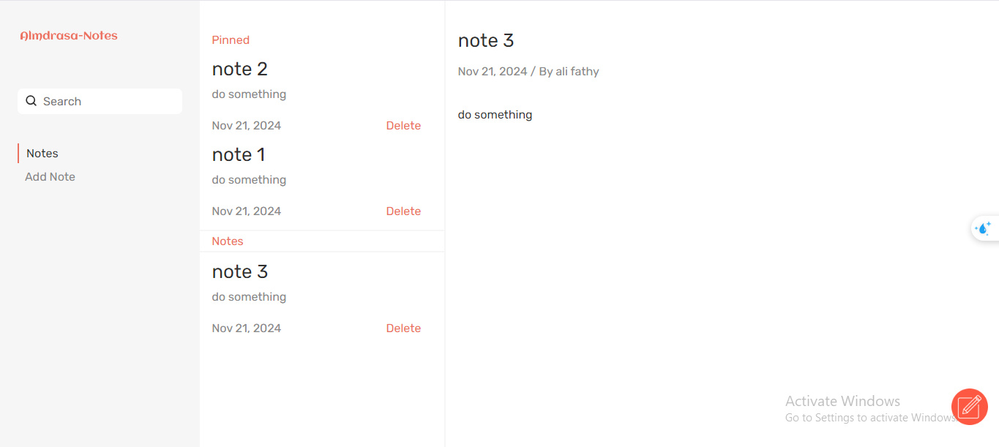

# Note Application

## Preview

  
---

## Introduction

The **Note Application** is a lightweight, feature-rich tool designed to help you organize your thoughts and tasks effortlessly. With a simple and intuitive interface, it allows users to add, edit, and delete notes seamlessly. The app also features smooth animations to enhance the user experience, making it both functional and visually appealing.

---

## Features

- **Add Notes**: Quickly create and save new notes with titles and content.  
- **Edit Notes**: Modify existing notes with ease, thanks to a user-friendly form interface.  
- **Delete Notes**: Remove unwanted notes permanently with a single click.  
- **Persistent Data**: Notes are stored in the browser's local storage, ensuring your data remains intact across sessions.  
- **Smooth Animations**: Experience sleek transitions when adding, editing, or deleting notes.  

---

## Technical Details

### Technologies Used
- **HTML5**: For building the structural foundation of the app.  
- **CSS/SCSS**: Handles the design, layout, and animations.  
- **JavaScript (ES6)**: Powers the core logic for creating, editing, deleting, and managing notes.  

### Key Features Implemented
1. **Local Storage**:  
   - Ensures that notes and preferences persist even after refreshing the page.  
2. **Dynamic UI Updates**:  
   - Automatically reflects changes in the notes list based on user actions.  
3. **Smooth animatioins**:  
   - Dynamically switches between operations with a smooth animations.  

---

## Usage

### Adding a Note
1. Click the "Add Note" button.  
2. Enter the title and content of the note.  
3. Save the note to add it to the list.  

### Editing a Note
1. Click on an existing note to edit it.  
2. Modify the title and/or content in the displayed form.  
3. Save the changes to update the note.  

### Deleting a Note
- Click the delete button next to a note to remove it from the list.  

### Update a note 
- Click the update button to simple show the module for update noet.  
